# open-cx-t1g1-ploggers Development Report

Welcome to the documentation pages of the AsQuestions of **openCX**!

* Business modeling 
  * [Product Vision](#Product-Vision)
  * [Elevator Pitch](#Elevator-Pitch)
* Requirements
  * [Use Case Diagram](#Use-case-diagram)
  * [User stories](#User-stories)
  * [Domain model](#Domain-model)
* Architecture and Design
  * [Logical architecture](#Logical-architecture)
  * [Physical architecture](#Physical-architecture)
  * [Prototype](#Prototype)
* [Implementation](#Implementation)
* [Test](#Test)
* [Configuration and change management](#Configuration-and-change-management)
* [Project management](#Project-management)

Please contact us!

Thank you!

Caio Nogueira

Diogo Almeida

João Pinto

Miguel Silva

Pedro Queirós

Telmo Botelho

---

## Product Vision

AsQuestions aims to encourage and simplify speaker-audience interaction during talks by providing an easy-to-use interface for posting, rating, and answering questions.

---
## Elevator Pitch

Clearing up the audience's doubts during a talk is often a difficult task for the speaker. It is impossible to guarantee that the most relevant questions don't end up unanswered. To solve this issue, AsQuestions provides a talk-targeted interface that allows attendees to post their doubts for everyone in the room. The audience can then upvote the ones they want to see answered and downvote the ones they find less interesting. This way, the speaker can effortlessly see what questions and topics to cover in the Q&A section of the talk.

---
## Requirements

### Use Case Diagram

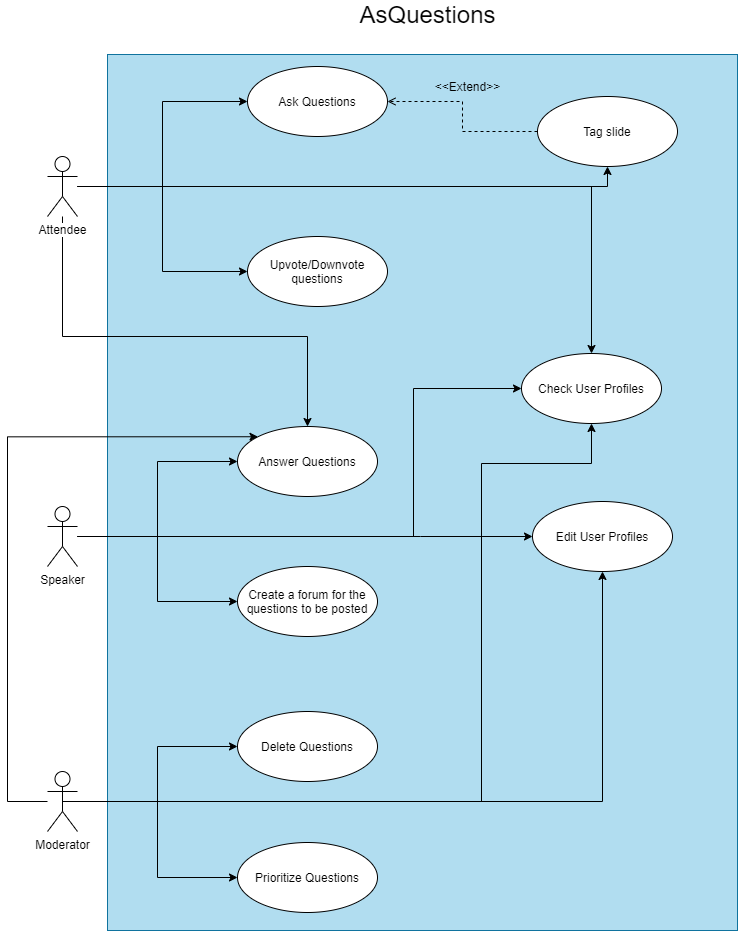

---

### User Stories

#### **Story #1**

As an attendee, I want to post questions so that the speaker or other attendees can answer them.

_User interface mockups_

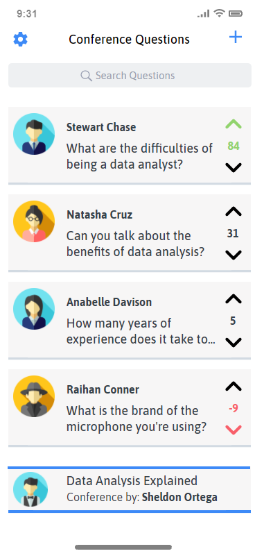
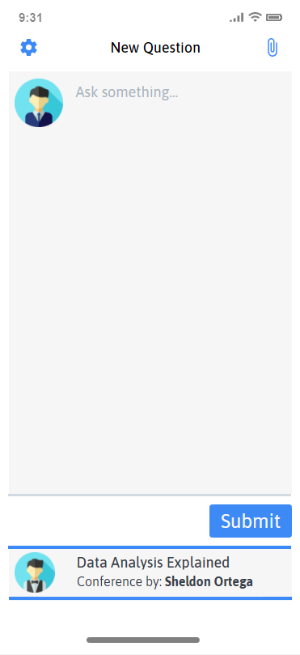


_Acceptance Tests_

```gherkin
Scenario: Posting a question
	Given there are 4 questions asked in the forum
	When I tap the "Post a Question (+ icon)" button
	And I write and submit a question
	Then there are 5 questions asked in the forum.
```

_Value/Effort_

Value: Must have

Effort: XL

---
#### **Story #2**

As an attendee, I want to be able to mention a specific part of the presentation with my question (like a slide) to help the speaker better understand it.

_User interface mockups_

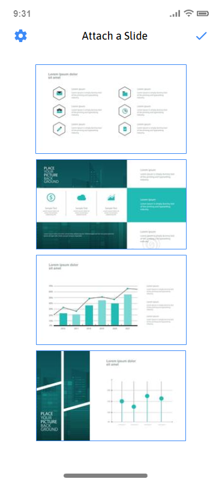

_Acceptance Tests_

```gherkin
Scenario: Mentioning/Tagging a part of the presentation with my question
	Given that I'm posting a question in the forum
	When I click on the "Add a Slide (Clip icon)" button
	Then the app allows me to refer a slide related to my question, through its number or picture
	When I click on the "Confirm Selection (Verified icon)"
	Then the app attaches that slide to my question
```
_Value/Effort_

Value: Should have

Effort: M

---
#### **Story #3**

As an attendee, I want to see and answer questions so that I can help the other attendees.

_User interface mockups_

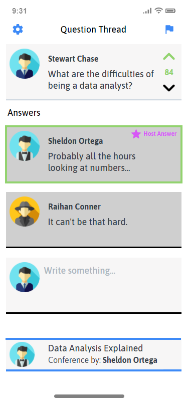

_Acceptance Tests_
```gherkin
Scenario: Answering other attendees' questions
	Given there are 4 questions asked in the forum,
	When I click on one of them
	Then the app shows me the question and its comment thread
	When I tap the Textbox
	Then the system allows me to write an answer 
	When I tap the "Submit Answer" button
	Then the system posts the answer to the thread
```
_Value/Effort_

Value: Must have

Effort: L

---
#### **Story #4**

As an attendee, I want to be able to see and upvote/downvote questions so that the speaker knows which questions are most relevant for the audience.

_User interface mockups_


_Acceptance Tests_
```gherkin
Scenario: Upvoting/Downvoting posted questions
	Given there are 3 questions asked in the forum
	When I click on the "Upvote (Arrow up icon)" buttons next to the questions
	Then their score increases improving their visibility in the forum
	When I click on the "Downvote (Arrow down icon)" buttons next to the questions
	Then their score decreases lowering their visibility in the forum
```
_Value/Effort_

Value: Must Have

Effort: M

---
#### **Story #5**

As a speaker, I want to answer my audience’s questions so that they can leave the session clarified and informed.

_User interface mockups_

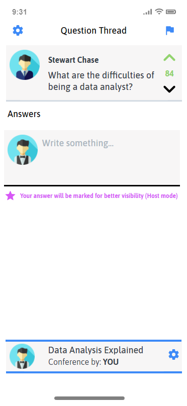

_Acceptance Tests_
```gherkin
Scenario: Answering questions from the audience
	Given I'm logged in as a speaker and there are 3 questions asked in the forum 
	When I click on one of them
	Then the app shows me the question and its comment thread
	When I tap the Textbox
	Then the system allows me to write an answer
    When I tap the "Submit Answer" button
	Then the system posts the answer to the thread and attaches it at the top, marking it as the speaker's response
```
_Value/Effort_

Value: Must Have

Effort: XL

---
#### **Story #6**

As a speaker, I want to be able to create a forum for my audience to place their questions about the presentation.

_User interface mockups_

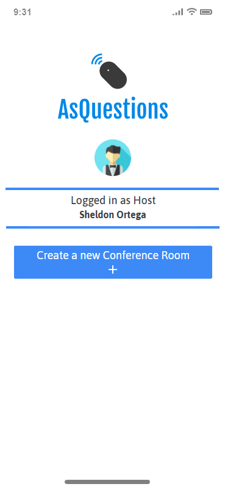
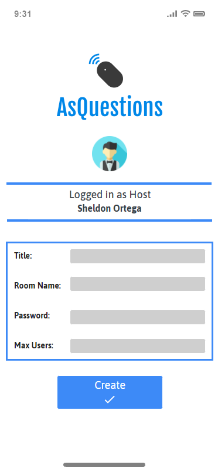

_Acceptance Tests_
```gherkin
Scenario: Creating a forum for the audience's questions
	Given I’m logged-in as a speaker
	Then the app shows me a menu of options
	When I click the "Create Talk Room" button
	Then the app shows me a form to fill with information about the talk
	When I click the "Create" button
	Then the app creates the empty question forum and takes me to it
```
_Value/Effort_

Value: Must Have

Effort: XL

---
#### **Story #7**

As a moderator, I want to be able to control what questions are passed to the speaker so that the most relevant are answered.

_User interface mockups_

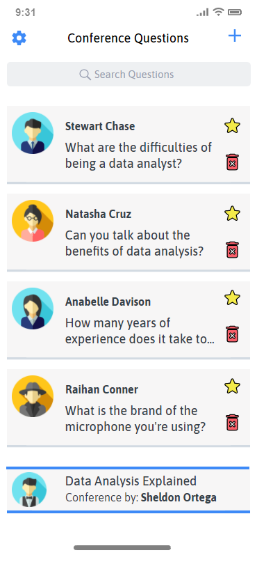

_Acceptance Tests_
```gherkin
Scenario: Controlling which questions are passed to the speaker
	Given I’m logged-in as a moderator and there are 4 questions asked in the forum 
	When I click on "Send question to speaker (Star icon)"
	Then the system puts the question on top of the list for the speaker, ignoring the upvote/downvote system
	When I click on "Delete Question (Trash bin icon)"
	Then the app deletes that question from the forum
```
_Value/Effort_

Value: Should Have

Effort: M

---
#### **Story #8**

As a user, I want to be able to navigate between the various app sections.

_User interface mockups_

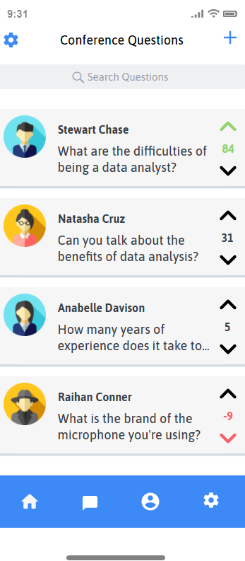

_Acceptance Tests_
```gherkin
Scenario: Navigating between the different app sections 
	Given I'm logged in as any type of user (attendee/speaker/moderator)
	When I click on "Navigate to the Home Page (Home Icon)" button on the Navigation Bar
	Then the app takes me to the Home Page
	When I click on "Navigate to the Talk Questions Section (Message Icon)" button on the Navigation Bar
	Then the app takes me to the Talk Questions section
	When I click on "Navigate to the User Profile (Person Icon)" button on the Navigation Bar
	Then the app takes me to the User Profile section
	When I click on "Navigate to Settings (Settings Icon)" button on the Navigation Bar
	Then the app takes me to the Settings
```
_Value/Effort_

Value: Must Have

Effort: XL

---
#### **Story #9**

As a user, I want to be able to see my profile and other users' profiles.

_User interface mockups_

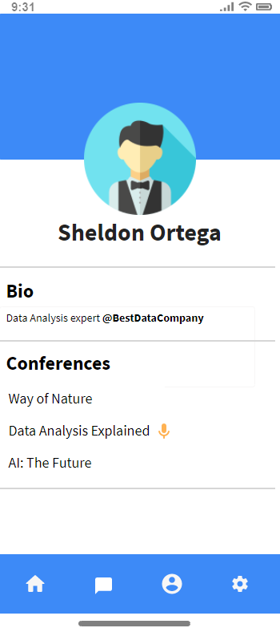


_Acceptance Tests_
```gherkin
Scenario: Checking User Profiles
	Given I'm logged in as any type of user (attendee/speaker/moderator) and I'm currently on the talk Questions page
	When I click on a person's icon near their question
	Then the app takes me to their profile, where I can see their bio and the talks they're attending
	When I click on "Navigate to the User Profile (Person Icon)" button on the Navigation Bar
	Then the app takes me to my profile, where I can see more details and edit my account details
```
_Value/Effort_

Value: Should Have

Effort: L

---
#### **Story #10**

As a user, I want a Sign In/Sign Up page.

_User interface mockups_

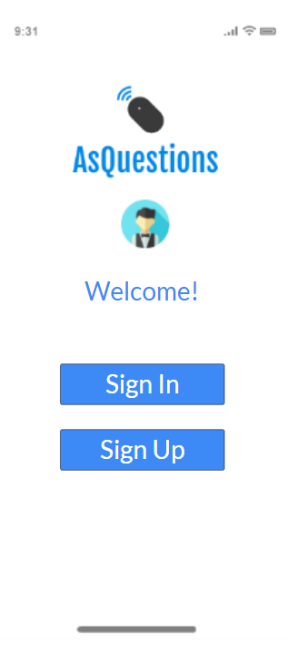

_Acceptance Tests_

```gherkin
Scenario: Choosing between signing in and signing up
	Given I just opened the app and I'm currently logged off of any account
	When I click Sign In
	Then the app takes me to a Sign In/Login page, where I can log in to the application
	When I click Sign Up
	Then the app takes me to a Sign Up/Register page, where I can fill in data and create an account
```

_Value/Effort_

Value: Must Have

Effort: L

---
#### **Story #11**

As a user, if I don't currently have an account, I want to be able to Sign Up/Register.

_User interface mockups_

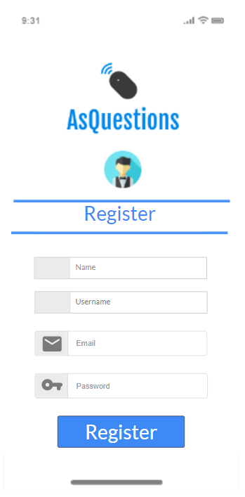

_Acceptance Tests_

```gherkin
Scenario: Creating a new account
	Given I'm currently on the Sign Up/Register page
	When I fill in all the required information
	Then the app creates my account using the data provided and let's me Sign In with that info
```

_Value/Effort_

Value: Must Have

Effort: L

---
#### **Story #12**

As a user, I want to be able to log in to my account

_User interface mockups_

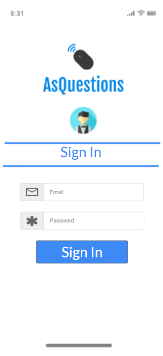

_Acceptance Tests_

```gherkin
Scenario: Logging in to an existing account
	Given I'm currently on the Sign Up/Login page
	When I fill in my email and password
	Then the app logs me in to my account and takes me to the Home Page
```

_Value/Effort_

Value: Must Have

Effort: L

---
#### **Story #13**

As a user, I want to see, join and search for different talks.

_User interface mockups_

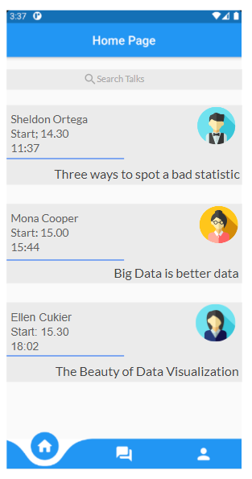

_Acceptance Tests_

```gherkin
Scenario: Browsing different talks
	Given I'm currently in the Home Page screen
	When I click on one of the talks shown in the page
	Then the app takes me to the talk's respective forum
```

_Value/Effort_

Value: Must Have

Effort: L

---


### Domain model

To better understand the context of the software system, it is very useful to have a simple UML class diagram with all the key concepts (names, attributes) and relationships involved of the problem domain addressed by your module.

------

## Architecture and Design

The architecture of a software system encompasses the set of key decisions about its overall organization. The following sections show the connection between the technologies and modules used in this project.

### Logical architecture

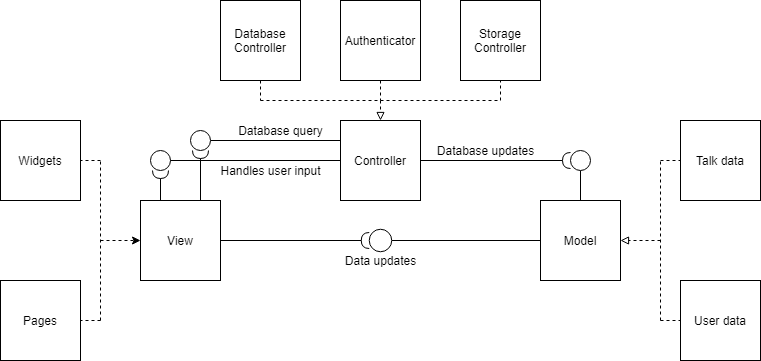

Our high-level logical structure of the code will follow the Architectural Pattern - MVC (Model-View-Controller), since it is an industry standard and usually recommended for this type of project. This pattern splits the code in three different parts, keeping them independent of each other.

- The first one is the **Model** which contains all the application data, such as information about each talk, question or user, etc.
- The **View** displays the information from the Model to the users and sends input information to the Controller.
- The **Controller** links the other parts, deciding how the data from the Model will change according to the actions made by the user and reported by the View.

### Physical architecture

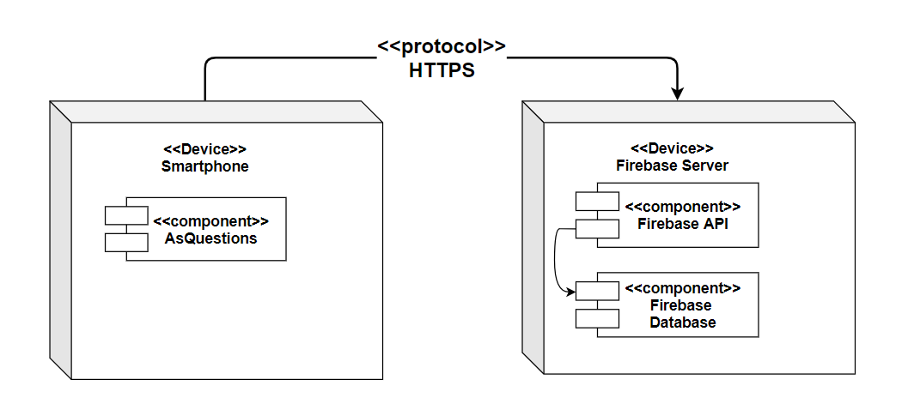

For this project we are using Flutter, a software development kit created by Google as our mobile application framework since it is one of the most used mobile development frameworks and it was recommended to us by our teacher.

For the app's database, we decided to use Firebase since both Firebase and Flutter were developed by Google, which makes its integration on the project simple. This database server is used to save all needed data such as users, talks, questions and comments, etc.

The communication between both sides of the application is done over HTTPS, retrieving/storing all information needed from the database.

### Prototype

To help on validating all the architectural, design and technological decisions made, we usually implement a vertical prototype, a thin vertical slice of the system.

In this subsection please describe in more detail which, and how, user(s) story(ies) were implemented.

------

## Implementation

Regular product increments are a good practice of product management.

While not necessary, sometimes it might be useful to explain a few aspects of the code that have the greatest potential to confuse software engineers about how it works. Since the code should speak by itself, try to keep this section as short and simple as possible.

Use cross-links to the code repository and only embed real fragments of code when strictly needed, since they tend to become outdated very soon.

------

## Test

There are several ways of documenting testing activities, and quality assurance in general, being the most common: a strategy, a plan, test case specifications, and test checklists.

In this section it is only expected to include the following:

- test plan describing the list of features to be tested and the testing methods and tools;
- test case specifications to verify the functionalities, using unit tests and acceptance tests.

A good practice is to simplify this, avoiding repetitions, and automating the testing actions as much as possible.

------

## Configuration and change management

Configuration and change management are key activities to control change to, and maintain the integrity of, a project’s artifacts (code, models, documents).

For the purpose of ESOF, we will use a very simple approach, just to manage feature requests, bug fixes, and improvements, using GitHub issues and following the [GitHub flow](https://guides.github.com/introduction/flow/).

------

## Project management

Software project management is an art and science of planning and leading software projects, in which software projects are planned, implemented, monitored and controlled.

In the context of ESOF, we expect that each team adopts a project management tool capable of registering tasks, assign tasks to people, add estimations to tasks, monitor tasks progress, and therefore being able to track their projects.

Example of tools to do this are:

- [Trello.com](https://trello.com/)
- [Github Projects](https://github.com/features/project-management/com)
- [Pivotal Tracker](https://www.pivotaltracker.com/)
- [Jira](https://www.atlassian.com/software/jira)

We recommend to use the simplest tool that can possibly work for the team.

------

## Evolution - contributions to open-cx

Describe your contribution to open-cx (iteration 5), linking to the appropriate pull requests, issues, documentation.

---
