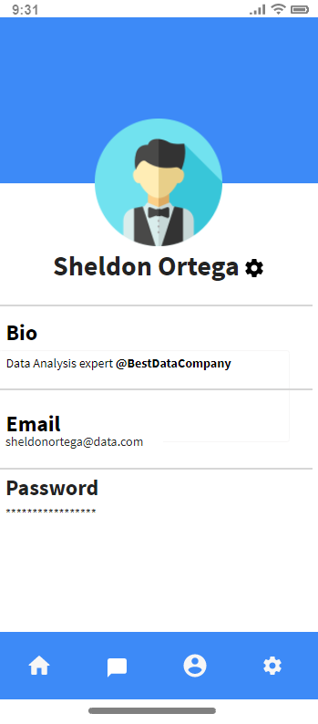

  
# open-cx-t1g1-ploggers Development Report

Welcome to the documentation pages of the AsQuestions of **openCX**!

* Business modeling 
  * [Product Vision](#Product-Vision)
  * [Elevator Pitch](#Elevator-Pitch)
* Requirements
  * [Use Case Diagram](#Use-case-diagram)
  * [User stories](#User-stories)
  * [Domain model](#Domain-model)
* Architecture and Design
  * [Logical architecture](#Logical-architecture)
  * [Physical architecture](#Physical-architecture)
  * [Prototype](#Prototype)
* [Implementation](#Implementation)
* [Test](#Test)
* [Configuration and change management](#Configuration-and-change-management)
* [Project management](#Project-management)

Please contact us!

Thank you!

Caio Nogueira

Diogo Almeida

João Pinto

Miguel Silva

Pedro Queirós

Telmo Botelho

---

## Product Vision

AsQuestions aims to encourage and simplify speaker-audience interaction during talks by providing an easy-to-use interface for posting, rating, and answering questions.

---
## Elevator Pitch

Clearing up the audience's doubts during a talk is often a difficult task for the speaker. It is impossible to guarantee that the most relevant questions don't end up unanswered. To solve this issue, AsQuestions provides a talk-targeted interface that allows attendees to post their doubts for everyone in the room. The audience can then upvote the ones they want to see answered and downvote the ones they find less interesting. This way, the speaker can effortlessly see what questions and topics to cover in the Q&A section of the talk.

---
## Requirements

### Use Case Diagram


#### Ask Questions:

*  **Actor**. Attendee.

*  **Description**. This use case exists so that the attendee can post their questions into the database to later be answered.

*  **Preconditions and Postconditions**.  To post a question the attendee must first join a talk’s page, being previously logged in. In the end, the user's question will be added to the database, and displayed on the forum.
  
*  **Normal Flow**. 
	1. The attendee presses the button to add a question to the talk.
	2. The attendee types his question.
	3. The attendee selects a slide to anex to the question.
	4. If the question have the allowed length, the system saves the question to the database, and displays it on the talk page.

*  **Alternative Flows and Exceptions**. 
	1. The attendee presses the button to add a question to the talk.
	2. The attendee types his question.
	3. The attendee selects a slide to anex to the question.
	4. If the question is too short, the system will respond with an error message.
	5. The user can then retype his question, and proceed as normal.

#### Upvote/Downvote Questions:

*  **Actor**. Attendee.

*  **Description**. This use case exists for filter questions, making the most requested to the top of the list.

*  **Preconditions and Postconditions**.  To upvote or downvote a question the attendee must first join a talk’s page, being previously logged in. After voting, the vote will then be added to the total count.

*  **Normal Flow**. 
	1. The attendee presses the up or downvote button.
	2. The system adds the vote to the respective count or removes it if the button had been pressed earlier.

#### Answer Questions:

*  **Actor**. All Users

*  **Description**. This use case exists so that the users can answer each other's questions.

*  **Preconditions and Postconditions**.  To make an answer the user must first join a talk's page, being previously logged in. In the end, the user's answer will be added to the database, and displayed as a reply to the chosen question.

*  **Normal Flow**. 
	1. The user selects a question he wants to answer.
	2. The user types his answer.
	3. If it's within the allowed length, the system saves the answer to the database, and displays it as a reply to the selected question.

*  **Alternative Flows and Exceptions**. 
	1. The attendee selects a question he wants to answer.
	2. The attendee types his answer.
	3. If the answer is shorter than the character limit, the system sends an error message.
	4. The user can then retype his answer and proceed as normal.

#### Create a talk page:

*  **Actor**. Speaker

*  **Description**. This use case exists so that the speaker can create a talk page where the users can interact.

*  **Preconditions and Postconditions**.  To create a talk page the only precondition is to the user be logged in. In the end, the speaker talk page  will be added to the database, and displayed as talk.

*  **Normal Flow**. 
	1. The speaker presses the create a talk button.
	2. The speaker creates is talk.
	3. The system saves it to the database and displays it on the talks page.

#### Delete Questions:

*  **Actor**. Moderator.

*  **Description**. This use case exists so talk moderators can delete questions that are not relevant to the topic at hand.

*  **Preconditions and Postconditions**.  To delete a question the user must first join a talk's page, being previously logged in as a moderator. In the end, the selected question will be removed.

*  **Normal Flow**. 
	1. The moderator chooses a question.
	2.  The moderator signals the system to remove it.
	3. The system removes the question from the database.

#### Prioritize Questions:

*  **Actor**. Moderator

*  **Description**. This use case exists so that the moderator can make it easy for the speaker to see the most relevant user's questions.

*  **Preconditions and Postconditions**.  To prioritize a question the user must first join a talk's page, being previously logged in as a moderator. In the end, the user's question prioritized will be rearranged to the database and displayed as the top of the list of questions on that talk page.

*  **Normal Flow**. 
	1. The moderator selects a question he wants to prioritize.
	2. The moderator selects the send question to speaker button.
	3. The system rearranges the questions on the database and displays the prioritized questions on top of the talk page.

#### Check User Profiles:

*  **Actor**. All users.

*  **Description**. This use case exists so that users can check each other profiles.

*  **Preconditions and Postconditions**.  To check a profile the user has to have the app installed on the device, be logged in, and be in a talk page. 

*  **Normal Flow**. 
	1. The user selects one profile in the talk page questions.
	2. The system displays the user profile stored in the database.
---

### User Stories

#### **Story #1**

As an attendee, I want to post questions so that the speaker or other attendees can answer them.

_User interface mockups_


_Acceptance Tests_

```gherkin
Scenario: Posting a question
	Given there are 4 questions asked in the forum
	When I tap the "Post a Question (+ icon)" button
	And I write and submit a question
	Then there are 5 questions asked in the forum.
```

_Value/Effort_

Value: Must have

Effort: XL

---
#### **Story #2**

As an attendee, I want to be able to mention a specific part of the presentation with my question (like a slide) to help the speaker better understand it.

_User interface mockups_


_Acceptance Tests_

```gherkin
Scenario: Mentioning/Tagging a part of the presentation with my question
	Given that I'm posting a question in the forum
	When I click on the "Add a Slide (Clip icon)" button
	Then the app allows me to refer a slide related to my question, through its number or picture
	When I click on the "Confirm Selection (Verified icon)"
	Then the app attaches that slide to my question
```
_Value/Effort_

Value: Should have

Effort: M

---
#### **Story #3**

As an attendee, I want to see and answer questions so that I can help the other attendees.

_User interface mockups_


_Acceptance Tests_
```gherkin
Scenario: Answering other attendees' questions
	Given there are 4 questions asked in the forum,
	When I click on one of them
	Then the app shows me the question and its comment thread
	When I tap the Textbox
	Then the system allows me to write an answer 
	When I tap the "Submit Answer" button
	Then the system posts the answer to the thread
```
_Value/Effort_

Value: Must have

Effort: L

---
#### **Story #4**

As an attendee, I want to be able to see and upvote/downvote questions so that the speaker knows which questions are most relevant for the audience.

_User interface mockups_


_Acceptance Tests_
```gherkin
Scenario: Upvoting/Downvoting posted questions
	Given there are 3 questions asked in the forum
	When I click on the "Upvote (Arrow up icon)" buttons next to the questions
	Then their score increases improving their visibility in the forum
	When I click on the "Downvote (Arrow down icon)" buttons next to the questions
	Then their score decreases lowering their visibility in the forum
```
_Value/Effort_

Value: Must Have

Effort: M

---
#### **Story #5**

As a speaker, I want to answer my audience’s questions so that they can leave the session clarified and informed.

_User interface mockups_


_Acceptance Tests_
```gherkin
Scenario: Answering questions from the audience
	Given I'm logged in as a speaker and there are 3 questions asked in the forum 
	When I click on one of them
	Then the app shows me the question and its comment thread
	When I tap the Textbox
	Then the system allows me to write an answer
    When I tap the "Submit Answer" button
	Then the system posts the answer to the thread and attaches it at the top, marking it as the speaker's response
```
_Value/Effort_

Value: Must Have

Effort: XL

---
#### **Story #6**

As a speaker, I want to be able to create a forum for my audience to place their questions about the presentation.

_User interface mockups_


_Acceptance Tests_
```gherkin
Scenario: Creating a forum for the audience's questions
	Given I’m logged-in as a speaker
	Then the app shows me a menu of options
	When I click the "Create Talk Room" button
	Then the app shows me a form to fill with information about the talk
	When I click the "Create" button
	Then the app creates the empty question forum and takes me to it
```
_Value/Effort_

Value: Must Have

Effort: XL

---
#### **Story #7**

As a moderator, I want to be able to control what questions are passed to the speaker so that the most relevant are answered.

_User interface mockups_


_Acceptance Tests_
```gherkin
Scenario: Controlling which questions are passed to the speaker
	Given I’m logged-in as a moderator and there are 4 questions asked in the forum 
	When I click on "Send question to speaker (Star icon)"
	Then the system puts the question on top of the list for the speaker, ignoring the upvote/downvote system
	When I click on "Delete Question (Trash bin icon)"
	Then the app deletes that question from the forum
```
_Value/Effort_

Value: Should Have

Effort: M

---
#### **Story #8**

As a user, I want to be able to navigate between the various app sections.

_User interface mockups_


_Acceptance Tests_
```gherkin
Scenario: Navigating between the different app sections 
	Given I'm logged in as any type of user (attendee/speaker/moderator)
	When I click on "Navigate to the Home Page (Home Icon)" button on the Navigation Bar
	Then the app takes me to the Home Page
	When I click on "Navigate to the Talk Questions Section (Message Icon)" button on the Navigation Bar
	Then the app takes me to the Talk Questions section
	When I click on "Navigate to the User Profile (Person Icon)" button on the Navigation Bar
	Then the app takes me to the User Profile section
	When I click on "Navigate to Settings (Settings Icon)" button on the Navigation Bar
	Then the app takes me to the Settings
```
_Value/Effort_

Value: Must Have

Effort: XL

---
#### **Story #9**

As a user, I want to be able to see my profile and other users' profiles.

_User interface mockups_




_Acceptance Tests_
```gherkin
Scenario: Checking User Profiles
	Given I'm logged in as any type of user (attendee/speaker/moderator) and I'm currently on the talk Questions page
	When I click on a person's icon near their question
	Then the app takes me to their profile, where I can see their bio and the talks they're attending
	When I click on "Navigate to the User Profile (Person Icon)" button on the Navigation Bar
	Then the app takes me to my profile, where I can see more details and edit my account details
```
_Value/Effort_

Value: Should Have

Effort: L

---
#### **Story #10**

As a user, I want a Sign In/Sign Up page.

_User interface mockups_


_Acceptance Tests_

```gherkin
Scenario: Choosing between signing in and signing up
	Given I just opened the app and I'm currently logged off of any account
	When I click Sign In
	Then the app takes me to a Sign In/Login page, where I can log in to the application
	When I click Sign Up
	Then the app takes me to a Sign Up/Register page, where I can fill in data and create an account
```

_Value/Effort_

Value: Must Have

Effort: L

---
#### **Story #11**

As a user, if I don't currently have an account, I want to be able to Sign Up/Register.

_User interface mockups_


_Acceptance Tests_

```gherkin
Scenario: Creating a new account
	Given I'm currently on the Sign Up/Register page
	When I fill in all the required information
	Then the app creates my account using the data provided and let's me Sign In with that info
```

_Value/Effort_

Value: Must Have

Effort: L

---
#### **Story #12**

As a user, I want to be able to log in to my account

_User interface mockups_


_Acceptance Tests_

```gherkin
Scenario: Logging in to an existing account
	Given I'm currently on the Sign Up/Login page
	When I fill in my email and password
	Then the app logs me in to my account and takes me to the Home Page
```

_Value/Effort_

Value: Must Have

Effort: L

---
#### **Story #13**

As a user, I want to see, join and search for different talks.

_User interface mockups_


_Acceptance Tests_

```gherkin
Scenario: Browsing different talks
	Given I'm currently in the Home Page screen
	When I click on one of the talks shown in the page
	Then the app takes me to the talk's respective forum
```

_Value/Effort_

Value: Must Have

Effort: L

---


### Domain model


Our app concepts are simple and easy to understand, consisting of talks, users and posts. Every user can be connected to a talk, either as an attendee or as a host/moderator. Attendees can create questions on the talk's forum, possibly using the presentation's slides to help the host better understand what the question is about - or answer another user's post, by creating a comment on the respective post.

------

## Architecture and Design

The architecture of a software system encompasses the set of key decisions about its overall organization. The following sections show the connection between the technologies and modules used in this project.

### Logical architecture


Our high-level logical structure of the code will follow the Architectural Pattern - MVC (Model-View-Controller), since it is an industry standard and usually recommended for this type of project. This pattern splits the code in three different parts, keeping them independent of each other.

- The first one is the **Model** which contains all the application data, such as information about each talk, question or user, etc.
- The **View** displays the information from the Model to the users and sends input information to the Controller.
- The **Controller** links the other parts, deciding how the data from the Model will change according to the actions made by the user and reported by the View.

### Physical architecture


For this project we are using Flutter, a software development kit created by Google as our mobile application framework since it is one of the most used mobile development frameworks, having many appealing built-in features.

For the app's database, we decided to use Firebase since both Firebase and Flutter were developed by Google, which makes its integration on the project simple. This database server is used to save all needed data such as users, talks, questions and comments, etc.

The communication between both sides of the application is done over HTTPS, retrieving/storing all information needed from the database.


### Prototype

For the application prototype, we decide to start with our Story #3, which states that "As an attendee, I want to see and answer questions so that I can help the other attendees.", this being the basis of our app.


We've laid out the general structure of a talk room page, and while we still don't have a real database to connect to, we've added the functionality to allow users to create and submit their questions, which will be temporarily stored by the app and then be displayed in the talks page. Also, work has begun on the question voting system, which for the moment only stores the counting in a local variable.

------

## Implementation

Changelogs for the 4 different product increments can be found [here](https://github.com/FEUP-ESOF-2020-21/open-cx-t1g1-ploggers/releases).

------

## Test

In order to test our app's features we implemented acceptance tests using the **gherkin package**. These tests are divided in two parts, the features and the steps. The features are described in **.feature** files using the same language used in the acceptance tests. The steps are defined in **.dart** files and are responsible for performing the actions described in the features. We decided to implement automated tests for the most important features of our app, such as:

- Highlighting a question
- Posting a question and anexing a slide
- Upvoting/Downvoting a question

------

## Configuration and change management

Configuration and change management are key activities to control change to, and maintain the integrity of, a project’s artifacts (code, models, documents).

For the purpose of ESOF, we will use a very simple approach, just to manage feature requests, bug fixes, and improvements, using GitHub issues and following the [GitHub flow](https://guides.github.com/introduction/flow/).

------

## Project management

Our project management tool of choice was [Github Projects](https://github.com/FEUP-ESOF-2020-21/open-cx-t1g1-ploggers/projects/1), since it is simple and allows us to register, assign and monitor tasks.

------
