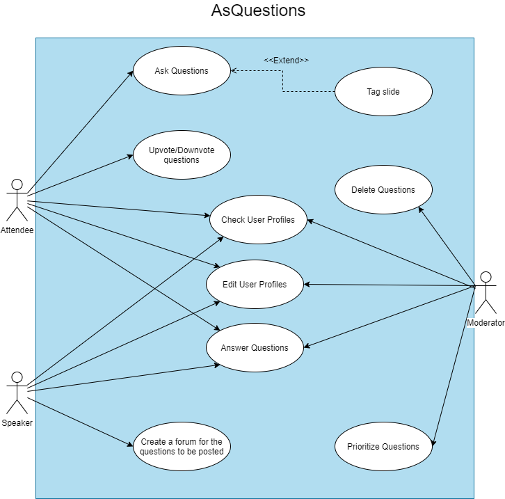

# open-cx-t1g1-ploggers Development Report

Welcome to the documentation pages of the AsQuestions of **openCX**!

* Business modeling 
  * [Product Vision](#Product-Vision)
  * [Elevator Pitch](#Elevator-Pitch)
* Requirements
  * [Use Case Diagram](#Use-case-diagram)
  * [User stories](#User-stories)
  * [Domain model](#Domain-model)
* Architecture and Design
  * [Logical architecture](#Logical-architecture)
  * [Physical architecture](#Physical-architecture)
  * [Prototype](#Prototype)
* [Implementation](#Implementation)
* [Test](#Test)
* [Configuration and change management](#Configuration-and-change-management)
* [Project management](#Project-management)

Please contact us!

Thank you!

Caio Nogueira

Diogo Almeida

João Pinto

Miguel Silva

Pedro Queirós

Telmo Botelho

---

## Product Vision

AsQuestions aims to encourage and simplify host-attendee interaction during conferences by providing an easy-to-use interface for posting, rating, and answering questions.

---
## Elevator Pitch

---
## Requirements

### Use Case Diagram



---

### User Stories

#### **Story #1**

As an attendee, I want to post questions so that the host or other attendees can answer them.

_User interface mockups_


_Acceptance Tests_

```gherkin
Scenario: Posting a question
	Given there are 2 questions asked in the forum
	When I tap the "Post a Question" button
	And I write and submit a question
	Then there are 3 questions asked in the forum.
```

_Value/Effort_

Value: Must have

Effort: XL

---
#### **Story #2**

As an attendee, I want to be able to mention a specific part of the presentation with my question (like a slide) to help the host better understand it.

_User interface mockups_


_Acceptance Tests_

```gherkin
Scenario: Mentioning/Tagging a part of the presentation with my question
	Given that I'm posting a question in the forum
	When I click on the "Add a Slide" button
	Then the app allows me to refer a slide related to my question
```
_Value/Effort_

Value: Should have

Effort: M

---
#### **Story #3**

As an attendee, I want to answer questions so that I can help the other attendees.

_User interface mockups_


_Acceptance Tests_
```gherkin
Scenario: Answering other attendees' questions
	Given there are 3 questions asked in the forum,
	When I click on one of them
	Then the app shows me the question and its comment thread
	When I tap the "Answer Question" button
	Then the system allows me to write an answer 
	When I tap the "Submit Answer" button
	Then the system posts the answer to the thread
```
_Value/Effort_

Value: Must have

Effort: L

---
#### **Story #4**

As an attendee, I want to be able to upvote/downvote questions so that the host knows which questions are most relevant for the audience.

_User interface mockups_


_Acceptance Tests_
```gherkin
Scenario: Upvoting/Downvoting posted questions
	Given there are 3 questions asked in the forum
	When I click on the "Upvote" or "Downvote" buttons next to the questions
	Then their score increases or decreases respectively affecting their visibility in the forum
```
_Value/Effort_

Value: Must Have

Effort: M

---
#### **Story #5**

As a host, I want to answer my audience’s questions so that they can leave the session clarified and informed.

_User interface mockups_


_Acceptance Tests_
```gherkin
Scenario: Answering questions from the audience
	Given I'm logged in as a host and there are 3 questions asked in the forum 
	When I click on one of them
	Then the app shows me the question and its comment thread
	When I tap the "Answer Question" button
	Then the system allows me to write an answer
    	When I tap the "Submit Answer" button
	Then the system posts the answer to the thread and fixes it at the top, marking it as the host's response
```
_Value/Effort_

Value: Must Have

Effort: XL

---
#### **Story #6**

As a host, I want to be able to create a forum for my audience to place their questions about the presentation.

_User interface mockups_


_Acceptance Tests_
```gherkin
Scenario: Creating a forum for the audience's questions
	Given I’m logged-in as a host
	Then the app shows me a menu of options
	When I click the ‘Create conference forum’ button
	Then the app creates the empty question forum and takes me to it
```
_Value/Effort_

Value: Must Have

Effort: XL

---
#### **Story #7**

As a moderator, I want to be able to control what questions are passed to the host so that the most relevant are answered.

_User interface mockups_


_Acceptance Tests_
```gherkin
Scenario: Controlling which questions are passed to the host
	Given I’m logged-in as a moderator and there are 3 questions asked in the forum 
	When I click on one of them
	Then the app shows me the question and its comment thread
	When I click on "Send question to host"
	Then the system puts the question on top of the list for the host, ignoring the upvote/downvote system
```
_Value/Effort_

Value: Should Have

Effort: M

---
